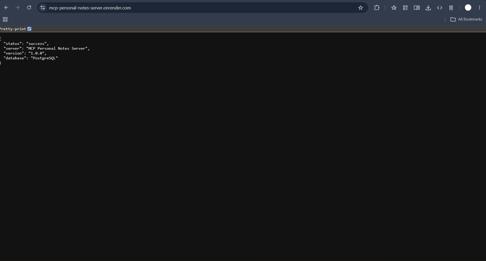
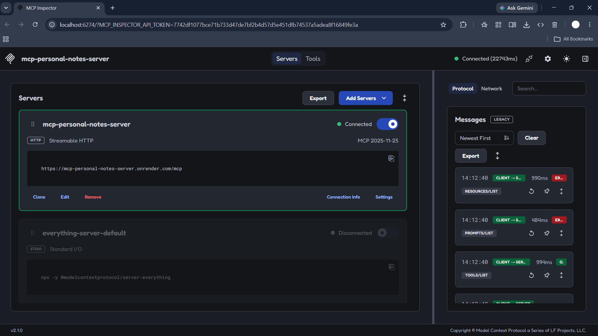
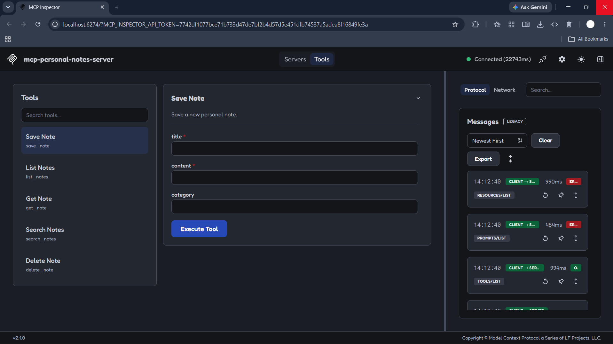
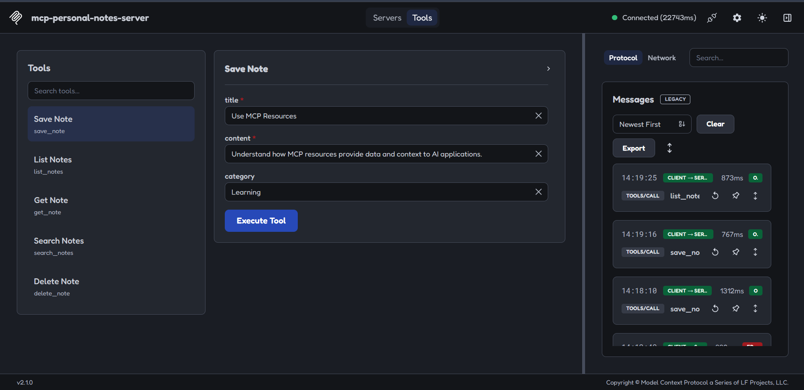
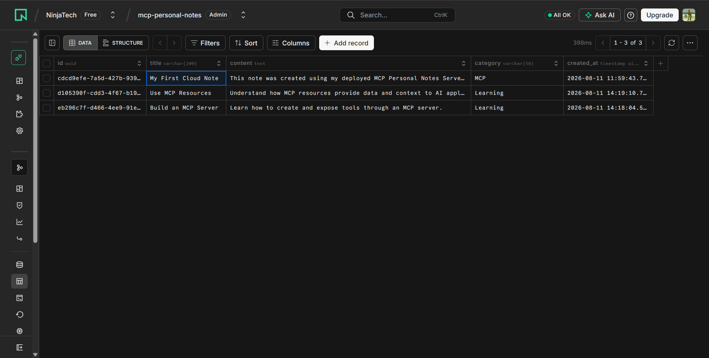
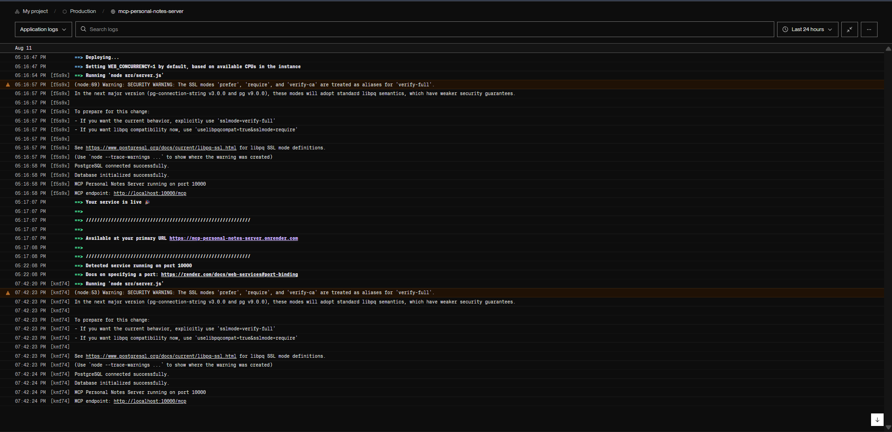

# 📝 MCP Personal Notes Server

> A beginner-friendly **Model Context Protocol (MCP)** server that lets
> AI applications manage personal notes through structured tools.

[](https://nodejs.org/)
[](https://modelcontextprotocol.io/)
[](https://www.postgresql.org/)
[](https://render.com/)

## 🚀 Live Demo

**Server:** https://mcp-personal-notes-server.onrender.com/

**MCP Endpoint:** https://mcp-personal-notes-server.onrender.com/mcp

The root URL intentionally returns a small JSON status response. The
`/mcp` endpoint is the actual MCP protocol endpoint and is meant to be
used by an MCP client or MCP Inspector.

---

## 📸 Project Screenshots

### 🌐 Live Server

The deployed server returns a health/status response from the root URL.



### 🔌 MCP Inspector — Connected

The deployed Streamable HTTP MCP endpoint is connected successfully through MCP Inspector.



### 🧰 Available MCP Tools

The server exposes five note-management tools: `save_note`, `list_notes`, `get_note`, `search_notes`, and `delete_note`.



### 📝 Save Note

A note can be created directly through the `save_note` MCP tool.



### 🗄️ PostgreSQL Database

Notes created through the MCP server are persisted in PostgreSQL.



### ☁️ Render Deployment

The production logs show PostgreSQL initialization, the MCP server starting, and the deployed service becoming available.



---

## 💡 What is this project?

The **MCP Personal Notes Server** is a simple project for learning how
the Model Context Protocol works.

Instead of building a traditional notes REST API, this project exposes
note-management capabilities as **MCP tools**.

An MCP-compatible AI client can use tools such as:

- `save_note`
- `list_notes`
- `get_note`
- `search_notes`
- `delete_note`

The project demonstrates the complete flow:

```text
AI / MCP Client
       │
       │ MCP
       ▼
MCP Personal Notes Server
       │
       │ SQL
       ▼
PostgreSQL
```

---

## ✨ Features

- 📝 Create personal notes
- 📋 List saved notes
- 🔎 Search notes by title, content, or category
- 📖 Retrieve a note by ID
- 🗑️ Delete notes
- 🗄️ PostgreSQL persistence
- 🌐 Deployed MCP endpoint
- 🔐 Environment-variable based database configuration
- 🧪 Testable with MCP Inspector
- 📦 Beginner-friendly Node.js implementation

---

## 🛠️ Tech Stack

Technology Purpose

---

JavaScript Application language
Node.js Runtime
Express.js HTTP server
MCP SDK Model Context Protocol implementation
PostgreSQL Persistent database
Neon Hosted PostgreSQL
Render Application deployment
MCP Inspector MCP testing

---

## 🧰 MCP Tools

### 1. `save_note`

Creates a new note.

**Input:**

```json
{
  "title": "Learn MCP",
  "content": "Understand how MCP tools work.",
  "category": "Learning"
}
```

---

### 2. `list_notes`

Returns all saved notes.

**Input:**

```json
{}
```

---

### 3. `get_note`

Retrieves one note using its UUID.

**Input:**

```json
{
  "id": "NOTE_UUID"
}
```

---

### 4. `search_notes`

Searches note title, content, and category.

**Input:**

```json
{
  "query": "MCP"
}
```

---

### 5. `delete_note`

Deletes a note using its UUID.

**Input:**

```json
{
  "id": "NOTE_UUID"
}
```

---

## 🏗️ Architecture

```text
                         ┌─────────────────────┐
                         │    AI / MCP Client   │
                         └──────────┬──────────┘
                                    │
                                    │ MCP / HTTP
                                    ▼
                    ┌─────────────────────────────┐
                    │   MCP Personal Notes Server │
                    │                             │
                    │  save_note                  │
                    │  list_notes                 │
                    │  get_note                   │
                    │  search_notes               │
                    │  delete_note                │
                    └──────────────┬──────────────┘
                                   │
                                   │ SQL
                                   ▼
                    ┌─────────────────────────────┐
                    │         PostgreSQL           │
                    │                             │
                    │           notes             │
                    └─────────────────────────────┘
```

### Deployment Architecture

```text
GitHub
   │
   │ Deploy from repository
   ▼
Render
   │
   │ DATABASE_URL
   ▼
Neon PostgreSQL
```

---

## 📁 Project Structure

```text
mcp-personal-notes-server/
│
├── src/
│   ├── server.js
│   ├── database.js
│   ├── database-init.js
│   ├── storage.js
│   │
│   └── tools/
│       └── notes.js
│
├── .env
├── .gitignore
├── package.json
├── package-lock.json
└── README.md
```

### Important files

**`src/server.js`**

Creates the Express application, MCP server, HTTP transport, health
endpoint, and `/mcp` endpoint.

**`src/database.js`**

Creates the PostgreSQL connection pool.

**`src/database-init.js`**

Creates the `notes` table when the server starts.

**`src/storage.js`**

Contains database operations for creating, reading, searching, and
deleting notes.

**`src/tools/notes.js`**

Registers the five MCP tools.

---

## ⚙️ Run Locally

### 1. Clone the repository

```bash
git clone https://github.com/SRCarlo/mcp-personal-notes-server.git
cd mcp-personal-notes-server
```

### 2. Install dependencies

```bash
npm install
```

### 3. Create `.env`

Create a `.env` file in the project root:

```env
PORT=3000
DATABASE_URL=YOUR_POSTGRESQL_CONNECTION_STRING
```

Never commit `.env` to GitHub.

### 4. Start development server

```bash
npm run dev
```

Expected output:

```text
PostgreSQL connected successfully.
Database initialized successfully.
MCP Personal Notes Server running on port 3000
MCP endpoint: http://localhost:3000/mcp
```

### 5. Check health

Open:

```text
http://localhost:3000/health
```

Expected:

```json
{
  "status": "healthy"
}
```

---

## 🧪 Test with MCP Inspector

Start MCP Inspector:

```bash
npx @modelcontextprotocol/inspector
```

For local testing use:

```text
http://localhost:3000/mcp
```

For the deployed server use:

```text
https://mcp-personal-notes-server.onrender.com/mcp
```

Select:

```text
Streamable HTTP
```

After connecting, open the **Tools** tab.

You should see:

```text
save_note
list_notes
get_note
search_notes
delete_note
```

---

## ☁️ Deployment

This project is deployed using:

- **Render** for the Node.js MCP server
- **Neon** for PostgreSQL

### Render configuration

**Build Command**

```bash
npm install
```

**Start Command**

```bash
npm start
```

### Environment variables

```text
NODE_ENV=production
DATABASE_URL=YOUR_NEON_CONNECTION_STRING
```

The application uses Render's `PORT` environment variable automatically:

```javascript
const PORT = process.env.PORT || 3000;
```

---

## 🔒 Security

This project follows a few basic security practices:

- Database credentials are stored in environment variables.
- `.env` is excluded from Git.
- SQL queries use PostgreSQL parameterized queries.
- The application does not expose the database connection string.
- Production configuration is supplied through Render environment
  variables.

**Never publish your real `DATABASE_URL` in source code or GitHub.**

---

## 🧠 What I Learned

This project was built to understand:

- What MCP is
- How MCP servers expose tools
- How an AI client can discover and call tools
- Streamable HTTP transport
- Node.js server development
- PostgreSQL integration
- Environment variables
- MCP Inspector testing
- Git and GitHub workflow
- Cloud deployment
- Connecting a deployed MCP server to an MCP client

---

## 🗺️ Future Improvements

Possible next versions:

- [ ] Add `update_note`
- [ ] Add `get_recent_notes`
- [ ] Add tags
- [ ] Add pagination
- [ ] Add authentication
- [ ] Add note ownership/user accounts
- [ ] Add full-text PostgreSQL search
- [ ] Add automated tests
- [ ] Add CI/CD with GitHub Actions
- [ ] Connect to an AI client for natural-language note management

---

## 🎯 Example AI Workflow

Once connected to an MCP-compatible AI client, the goal is to support
natural-language requests such as:

> Save a note titled "Learn Spring Boot" with the content "Study Spring
> Security and REST APIs" under the category "Learning".

The AI can discover the available MCP tools and call:

```text
save_note()
```

The resulting note is stored in PostgreSQL.

Another request could be:

> Find my notes about MCP.

The AI can use:

```text
search_notes()
```

This is the main idea behind the project:

```text
Natural Language
       ↓
AI
       ↓
MCP Tool
       ↓
Your Server
       ↓
PostgreSQL
```

---

## 📌 Project Status

**Status:** 🟢 Deployed and working

**MCP Transport:** Streamable HTTP

**Database:** PostgreSQL

**Deployment:** Render + Neon

**Testing:** MCP Inspector

---

## 👨‍💻 Author

### Shubham Raut — SRCarlo

Full Stack Java Developer | AI • Gen AI • IoT • Cloud

I build full-stack applications, AI-powered projects, and developer-focused tools while continuously exploring new technologies.

🔗 **GitHub:** [@SRCarlo](https://github.com/SRCarlo) | 🌐 **Portfolio:** [shubhuuraut.vercel.app](https://shubhuuraut.vercel.app/) | 💼 **LinkedIn:** [Shubham Raut](https://www.linkedin.com/in/shubham-raut-865a21203/)

---

## 📄 License

This project is available under the MIT License.

---

## ⭐ Support

If you found this project useful for learning MCP, AI tools, or backend development, consider giving the repository a ⭐.

---

<p align="center">
  Built with ❤️ by <a href="https://github.com/SRCarlo">Shubham Raut</a>
</p>
